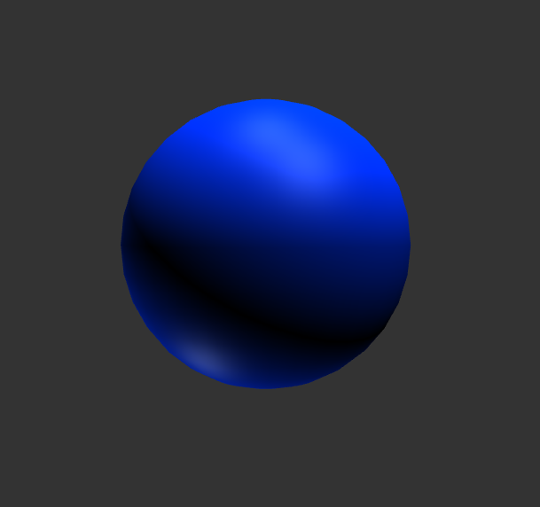
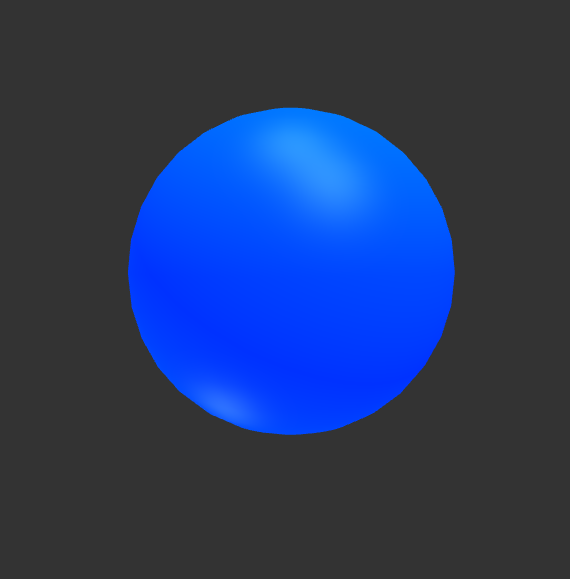

# Entry 1
##### 11/12/23

There's three tools in particular that I want to use for my freedom project. One is pretty much going to be the backbone of what I want to make, and the others are more supplementary.

The first tool I'm using is [three.js](https://threejs.org/). It's a library used to create 3D graphics in a webapp by using WebGL. Lots of different features such as meshes and lighting which I'll get into later. This year I want to make some cool website that will render atomic models for chemical elements, and to do that I need some sort of 3D graphics library, which is why I'm using this tool.

I also considered A-frame. In the end I decided to use Three instead because its logo looks cooler. Also, From what I've seen, it's just not as powerful or flexible as Three. Since A-frame uses a lot of HTML, it seemed more to me like a toy that an actual tool I could use in a project like this. 

The other tools are [HAML](https://haml.info/) and [SASS](https://sass-lang.com/). Not as important for my project, it's just that I'm too deep in the preprocessor rabbit hole. They're preprocessors for HTML and CSS respectively. The other part of the reason I'm using them is because I already have experience with them from my project last year. I'll just have to figure out some way to make my SASS talk to JS. I'm sure it's possible. I hope.

Now, I don't know if I just suck at following directions, but I couldn't get Three to work by following the instructions for installation in the manual. After an embarassing amount of time I still couldn't get that stupid green cube to show up on the page. Sooo I just ended up using a [project setup](https://github.com/Mugen87/three-jsm) (credit to Mugen87). It uses a bundler, but I'll bear with it for now. 

I figure I should give some context on how Three works. There's three main components that every app needs to have: the renderer, camera, and scene. Put simply, the scene is where all the stuff goes, the camera lets you see the scene, and the renderer, well, renders all of it. 

I needed to start somewhere. In 3D atomic models, subatomic particles are usually represented by spheres. Looking at the docs, there's already a constructor for spheres that I could use:

`const geometry = new THREE.SphereGeometry();`

Once you have the geometry, you need a material. There's a variety of different materials with different gimmicks, but I picked Phong because it could simulate shiny materials and is affected by lighting, which I both wanted. There's also a few different properties I could include in my material, such as the color I wanted and the color to emit from the mesh. 

```js
const material = new THREE.MeshPhongMaterial
    (
		{color: 0x0032ff},
		{emissive: 0x072534},
		{side: THREE.DoubleSide},
		{flatShading: false},
	);
```

Finally, I could add my material and geometry to the scene as a mesh:

`scene.add( new THREE.Mesh(geometry, material) );`

Without a light though, it just ends up looking like a black sphere.

To solve this, I wanted to add some lights. There were different kinds of lights, and at first I tried using Directional light (pretty self explanatory): 
```js
new THREE.DirectionalLight( 0xffffff, 0.75 ) // Color and Intensity
```


Too dark. So instead, I combined it with an Ambient light:
```js
const ambientLight = new THREE.AmbientLight( 0xffffff , 1 );
```


Looks pretty good, so that's where I'm stopping for now.

In the Engineering Design Process, I'm at step 4. I'm learning my tool so that I can apply what I have learned when it's time to actually create my project.

The skills I'm working on are how to learn and how to google. Instead of simply watching tutorials on my tool I've been reading the documentation and trying everything in my own IDE. 

[Next](entry02.md)

[Home](../README.md)