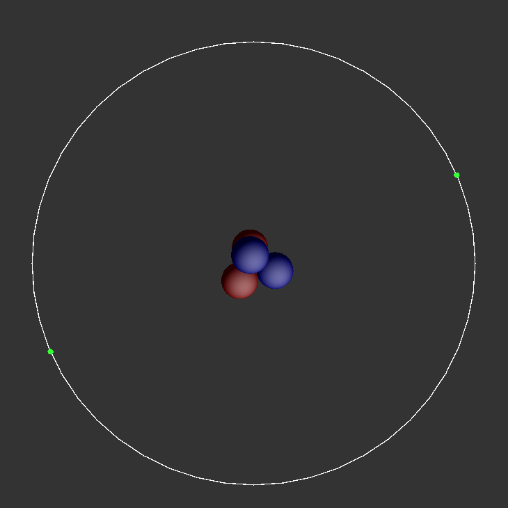
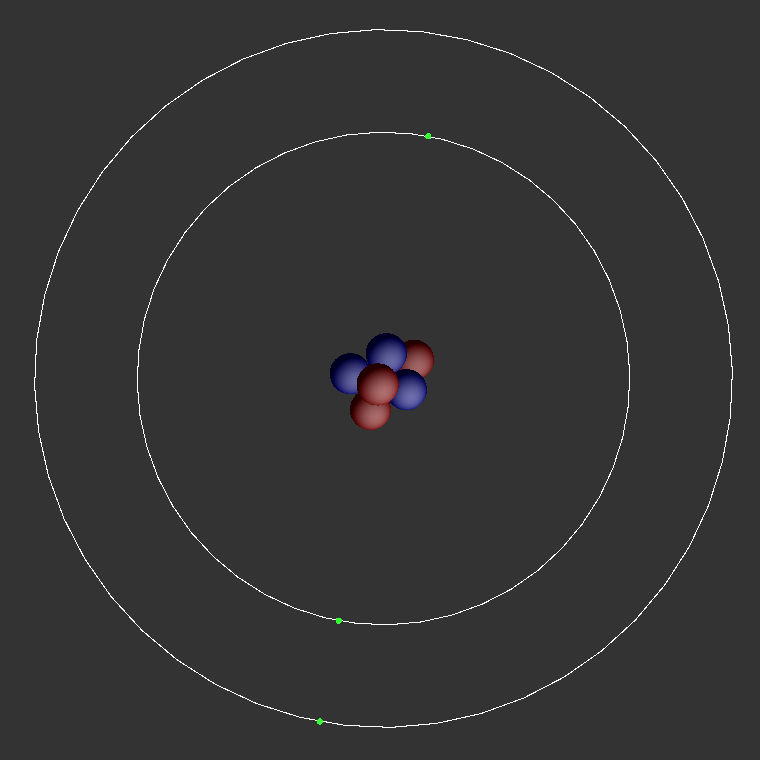

# Entry 4
##### 3/17/24

Disclaimer: It's highly likely that I'm using OOP in a very wrong way here. But it's too late to go back at this point

Since the last blog, I've come up with a general idea of how I want to structure my project. I'm not going to explain **everything** I did, like the nucleus physics and electron animations, because I already did that in previous blogs. What I'm going to do instead is explain how I've been able to put them together to make something that works.

I've created classes for each type of mesh that I want to add to my scene. For example:

```js
class Proton
{   constructor()
    {   this.mesh = new THREE.Mesh
        (   new THREE.SphereGeometry( 1, 32, 32 ),
            new THREE.MeshPhongMaterial
            (   {   color: 0xff0000,
                    side: THREE.DoubleSide,
                    shininess: 3,
                    specular: 0xffffff,
                    // wireframe: true
                }
            )
        );

        this.body = new CANNON.Body
        (   {   mass: 1,
                shape: new CANNON.Sphere( 1 ),
                position: new CANNON.Vec3( Math.random() * 10 - 5, Math.random() * 10 - 5, Math.random() * 10 - 5 )
		    }
        );
        this.mesh.name = 'protonMesh';
        this.body.name = 'protonBody';
    }
}
```
This is done for the neutrons, electron shells, and electrons as well. It may seem unecessarily convoluted, but in a bit I'll explain why I'm doing all of this.

Then I created a base class for the atom. This includes all of the methods and constructors that are going to be the same regardless of the identity of its children classes:

```js
class AbstractAtom
{   constructor( name, atomicNum, atomicMass, valenceElectrons )
    {   this.atomicNum = atomicNum;
        this.atomicMass = atomicMass;
        this.valenceElectrons = valenceElectrons;
        this.nucleons = this.initNucleus();
    }

    initNucleus()
    {   let nucleons = [];
        for ( let i = 0; i < this.atomicMass; i++ )
        {
            if ( i < this.atomicMass - this.atomicNum )
            {   nucleons.push( new Neutron() )   }
            else
            {   nucleons.push( new Proton() );   }
        }
        return nucleons;
    }

    initElectrons()
    {   throw new Error( 'createElectrons not implemented in base class.' );  }
}
```

Note that in the class method `initNucleus`, I'm creating instances of my Neutron and Proton classes, but I'm not actually accessing their meshes or adding them to the scene. That's because I have a separate class that takes in an instance of this `AbstractAtom` class as a parameter and uses its properties to add those meshes to the scene instead of doing it all in a single class, called an `AbstractAtomManager`. What are managers, you may ask? I don't really know myself, to be honest. I just couldn't figure out how to make my program work without one. I mean, the thought of the atom class adding its own meshes to the scene doesn't really make sense anyways. It would be easier on me to create a new class that would do that, even if it meant more lines of code.

```js
class AbstractAtomManager
{   constructor( atom )
    {   this.atom = atom;   }

    createNucleus( scene, world )
    {   for ( let i = 0; i < this.atom.nucleons.length; i++ )
        {   scene.add( this.atom.nucleons[i].mesh );
            world.addBody( this.atom.nucleons[i].body );

            this.atom.nucleons[i].body.linearDamping = 0.99;
            this.atom.nucleons[i].body.angularDamping = 0.99;
        }
    }

    createElectrons( scene )
    {    throw new Error( 'createElectrons not implemented in base class.' );   }

    copy()
    {   for ( let i = 0; i < this.atom.nucleons.length; i++ )
        {   this.atom.nucleons[i].mesh.position.copy( this.atom.nucleons[i].body.position );
            this.atom.nucleons[i].mesh.quaternion.copy( this.atom.nucleons[i].body.quaternion );
        }
    }

    pullOrigin()
    {   for ( let i = 0; i < this.atom.nucleons.length; i++ )
        {   this.atom.nucleons[i].body.force.set
            (   -this.atom.nucleons[i].body.position.x * 10,
                -this.atom.nucleons[i].body.position.y * 10,
                -this.atom.nucleons[i].body.position.z * 10,
            )
        }
    }

    initiateElectronRotation()
    {   throw new Error( 'initiateElectronRotation not implemented in base class.' );    }
}
```

Of course, these are base classes. Recall that for this project I'm representing the atoms with a Bohr model. Maybe I'll also do a quantum mechanical model if I have time. The Bohr model represents electrons in circular orbits with increasing distance from the nucleus, which are grouped into shells depending on their energy levels.

And if you've ever looked at a periodic table before, which I assume that you definitely have, you would've noticed a trend. For every increase in a period, the number of electron shells in the Bohr representation of those atoms increase. For instance:

* Helium (Atomic Number: 2, Period 1, 2 valence electrons):



* Lithium (Atomic Number: 3, Period 2, 1 valence electron):



Notice how for Lithium, the other shell has 2 electrons. Based on this, it can be assumed that for an element in a higher period, the non-valence shells will be completely filled.

Unfortunately, this assumption can only be made up to the third period. Past Calcium this doesn't work due to the order of electron filling.

So that's the current obstacle that I'm facing right now. But if I had to release what I made as an MVP **right** now, it'd still be functional. So I'd say I'm making some decent progress.

Based on this, I've been able to make a somewhat dynamic system for creating the first 20 elements:

```js
class ConcreteAtomP1 extends AbstractAtom
{   constructor( name, atomicNum, atomicMass, valenceElectrons )
    {   super( name, atomicNum, atomicMass, valenceElectrons );
        this.electronShell = new ElectronShellP1().mesh;
        this.electrons = this.initElectrons();
    }

    initElectrons()
    {   let electrons = [];
        for (let i = 0; i < this.valenceElectrons; i++)
        {   electrons.push( new Electron() );
            let angle = (i / this.valenceElectrons)  * Math.PI * this.valenceElectrons;
            let orbitX = Math.cos(angle) * 12;
            let orbitZ = Math.sin(angle) * 12;
            electrons[i].mesh.position.set(orbitX, 0, orbitZ);
        }
        return electrons;
    }
}
```
```js

class ConcreteAtomP1Manager extends AbstractAtomManager
{   createElectrons( scene )
    {   this.atom.electronShell.rotation.x += Math.PI / 2;
        scene.add(this.atom.electronShell);
        for (let i = 0; i < this.atom.electrons.length; i++)
        {   scene.add(this.atom.electrons[i].mesh);   }
    }

    initiateElectronRotation()
    {   let time = Date.now() * 0.001;
        for (let i = 0; i < this.atom.electrons.length; i++)
        {   let angle = (i / this.atom.electrons.length) * Math.PI * this.atom.electrons.length;
            let orbitX = Math.cos(time * 0.5 + angle) * 12;
            let orbitZ = Math.sin(time * 0.5 + angle) * 12;
            this.atom.electrons[i].mesh.position.set(orbitX, 0, orbitZ);
        }
    }
}
```

Period 1 elements are very simple. Only one electron shell, so I can simply hard code the atom class and its respective manager to handle it.

Period 2 has two shells. So simply create another helper method to return an array of shells instead, as well as create a multi-dimensional array to differentiate between electrons in different shells (because they would be distanced differently from the nucleus):

```js
class ConcreteAtomP2 extends AbstractAtom
{   constructor( name, atomicNum, atomicMass, valenceElectrons )
    {   super( name, atomicNum, atomicMass, valenceElectrons );
        this.electronShells = this.initShells();
        this.electrons = this.initElectrons();
    }

    initShells()
    {   let electronShells = [new ElectronShellP1().mesh, new ElectronShellP2().mesh];
        return electronShells;
    }

    initElectrons()
    {   let P1Electrons = [];
        P1ElectronLoop: for (let i = 0; i < 2; i++)
        {   P1Electrons.push( new Electron() );
            let angle = (i / 2)  * Math.PI * 2;
            let orbitX = Math.cos(angle) * 12;
            let orbitZ = Math.sin(angle) * 12;
            P1Electrons[i].mesh.position.set(orbitX, 0, orbitZ);
        }

        let P2Electrons = [];
        P2ElectronLoop: for ( let i = 0; i < this.valenceElectrons; i++)
        {   P2Electrons.push( new Electron() );
            let angle = (i / this.valenceElectrons) * Math.PI * 2;
            let orbitX = Math.cos(angle) * 17;
            let orbitZ = Math.sin(angle) * 17;
            P2Electrons[i].mesh.position.set(orbitX, 0, orbitZ);
        }
        return [P1Electrons, P2Electrons];
    }
}
```
```js
class ConcreteAtomP2Manager extends AbstractAtomManager
{   createElectrons( scene )
    {   for (let i = 0; i < 2; i++)
        {   this.atom.electronShells[i].rotation.x += Math.PI / 2;
            scene.add(this.atom.electronShells[i]);
        }

        for (let i = 0; i < this.atom.electrons.length; i++)
        {   for (let j = 0; j < this.atom.electrons[i].length; j++)
            {   scene.add(this.atom.electrons[i][j].mesh);  }
        }
    }

    initiateElectronRotation()
    {   let time = Date.now() * 0.001;
        rotateP1Electrons: for (let i = 0; i < 2; i++)
        {   let angle = (i / 2) * Math.PI * 2;
            let orbitX = Math.cos(time * 0.5 + angle) * 12;
            let orbitZ = Math.sin(time * 0.5 + angle) * 12;
            this.atom.electrons[0][i].mesh.position.set(orbitX, 0, orbitZ);
        }

        rotateP2Electrons: for (let i = 0; i < this.atom.electrons[1].length; i++)
        {   let angle = (i / this.atom.electrons[1].length) * Math.PI * 2;
            let orbitX = Math.cos(time * 0.5 + angle) * 17;
            let orbitZ = Math.sin(time * 0.5 + angle) * 17;
            this.atom.electrons[1][i].mesh.position.set(orbitX, 0, orbitZ);
        }
    }
}
```

And you can expect something similar for period 3 elements:

```js
class ConcreteAtomP3 extends AbstractAtom
{   constructor( name, atomicNum, atomicMass, valenceElectrons )
    {   super( name, atomicNum, atomicMass, valenceElectrons );
        this.electronShells = this.initShells();
        this.electrons = this.initElectrons();
    }

    initShells()
    {   let electronShells = [new ElectronShellP1().mesh, new ElectronShellP2().mesh, new ElectronShellP3().mesh];
        return electronShells;
    }

    initElectrons()
    {   let P1Electrons = [];
        P1ElectronLoop: for (let i = 0; i < 2; i++)
        {   P1Electrons.push( new Electron() );
            let angle = (i / 2) * Math.PI * 2;
            let orbitX = Math.cos(angle) * 12;
            let orbitZ = Math.sin(angle) * 12;
            P1Electrons[i].mesh.position.set(orbitX, 0, orbitZ);
        }

        let P2Electrons = [];
        P2ElectronLoop: for ( let i = 0; i < 8; i++)
        {   P2Electrons.push( new Electron() );
            let angle = (i / 8) * Math.PI * 2;
            let orbitX = Math.cos(angle) * 17;
            let orbitZ = Math.sin(angle) * 17;
            P2Electrons[i].mesh.position.set(orbitX, 0, orbitZ);
        }

        let P3Electrons = [];
        P3ElectronLoop: for ( let i = 0; i < this.valenceElectrons; i++)
        {   P3Electrons.push(new Electron() );
            let angle = (i / this.valenceElectrons) * Math.PI * 2;
            let orbitX = Math.cos(angle) * 22;
            let orbitZ = Math.sin(angle) * 22;
            P3Electrons[i].mesh.position.set(orbitX, 0, orbitZ);
        }
        return [P1Electrons, P2Electrons, P3Electrons];
    }
}
```
```js
class ConcreteAtomP3Manager extends AbstractAtomManager
{   createElectrons( scene )
    {   for (let i = 0; i < 3; i++)
        {   this.atom.electronShells[i].rotation.x += Math.PI / 2;
            scene.add(this.atom.electronShells[i]);
        }

        for (let i = 0; i < this.atom.electrons.length; i++)
        {   for (let j = 0; j < this.atom.electrons[i].length; j++)
            {   scene.add(this.atom.electrons[i][j].mesh);  }
        }
    }

    initiateElectronRotation()
    {   let time = Date.now() * 0.001;
        rotateP1Electrons: for (let i = 0; i < 2; i++)
        {   let angle = (i / 2) * Math.PI * 2;
            let orbitX = Math.cos(time * 0.5 + angle) * 12;
            let orbitZ = Math.sin(time * 0.5 + angle) * 12;
            this.atom.electrons[0][i].mesh.position.set(orbitX, 0, orbitZ);
        }

        rotateP2Electrons: for (let i = 0; i < 8; i++)
        {   let angle = (i / 8) * Math.PI * 2;
            let orbitX = Math.cos(time * 0.5 + angle) * 17;
            let orbitZ = Math.sin(time * 0.5 + angle) * 17;
            this.atom.electrons[1][i].mesh.position.set(orbitX, 0, orbitZ);
        }

        rotateP3Electrons: for (let i = 0; i < this.atom.electrons[2].length; i++)
        {   let angle = (i / this.atom.electrons[2].length) * Math.PI * 2;
            let orbitX = Math.cos(time * 0.5 + angle) * 22;
            let orbitZ = Math.sin(time * 0.5 + angle) * 22;
            this.atom.electrons[2][i].mesh.position.set(orbitX, 0, orbitZ);
        }
    }
}
```

But any further would be disastrous. I'm stopping here for now.

And one more thing - this is how the manager is used. Declare it, and then in the animation recursion loop call the methods to animate the atom:

```js
let manager = new ConcreteAtomP3Manager( new ConcreteAtomP3( 'Silicon', 14, 28, 4 ) );
```
```js
// In class "App"
animate()
{   requestAnimationFrame( this.animate );
    this.renderer.render( this.scene, this.camera );
    manager.initiateElectronRotation(); // Animates electrons
    manager.copy(); // Copies physics body to rendered mesh
    manager.pullOrigin(); // Puts neutrons and protons where they need to be
    this.world.step( 1 / 60 );
}
```

I'm at step 6 of the Engineering Design Process. At this point I've created a basic, usable project without any bugs and from here on I'm going to continue to add more features and refactor my code.

I'm working on the skills problem decomposition and organization. These are especially important considering the approach I am taking towards my project: organizing every component into separate classes to make it easier to create my project, even if it uses more lines of code. Because in the end, it's going to be more readable and efficient as well.

[Previous](entry03.md) | [Next](entry05.md)

[Home](../README.md)